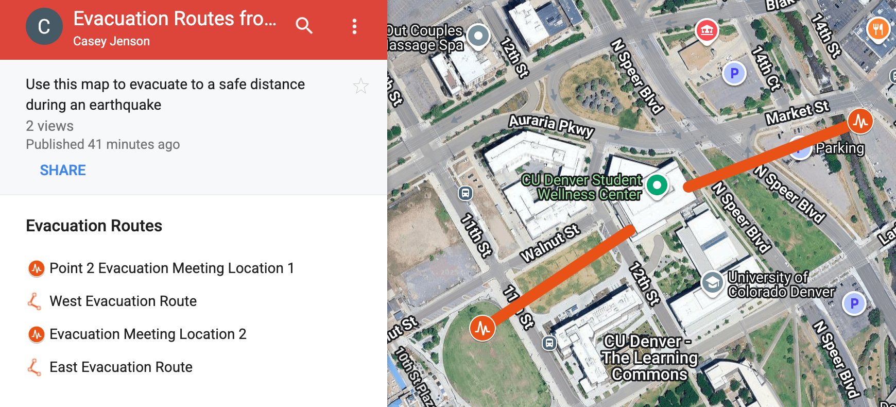

# Casey Jenson
I am currently a graduate student in The University of Colorado's Master of Science in Environmental Sciences program. 
Some of my recent projects inclue: 
- Thermal sensing of Green Infrastructure in Denver, CO.
- Assessing the Impact of Urban Heat Islands on Bumble Bee Populations in Colorado.

I am also a Research Associate Scientist at [CIRES](https://cires.colorado.edu/) and the program assistant at [Earth Lab](https://earthlab.colorado.edu/our-team/casey-jenson) and [ESIIL](https://esiil.org/) and at the University of Colorado Boulder. I am also a member of the North Central Regional Invasive Species and Climate Change Network team ([RISCC](https://nc-riscc.org/)). I am currently working with the USFS on identifying fire weather conditions.

## Background
I earned my Bachelor's in Envrionmental Science & Sustainability from [Concordia College](https://www.concordiacollege.edu/). 

I have also completed several certificate courses in remote sensing, and data analytics:
- 2025 Data Science: R Basics, [Harvard University EdX] (https://home.edx.org/)
- 2024 Intro to Plankton, Aerosol, Cloud, Ocean Ecosystem (PACE) Hyperspectral Observations for Water Quality Monitoring, [NASA ARSET](https://appliedsciences.nasa.gov/get-involved/training/english/arset-introduction-plankton-aerosol-cloud-ocean-ecosystem-pace)
- 2024 Invasive Species Monitoring with Remote Sensing Certificate, [NASA ARSET](https://appliedsciences.nasa.gov/get-involved/training/english/arset-invasive-species-monitoring-remote-sensing)

My background and interests are in: 
- Ecology
- Invasive Species Management
- Science Communication
- Green Infrastructure

I've also led several research projects within a range of topics including:  conservation biology, evolutionary biology, marine science, and urban heat islands.  Lastly, I am skilled in data analysis in R and Geographic Information Systems, ArcGISPro

## Events
Below are notable workshops, trainings, and events I have attended
- 2025 11th International Fire Ecology and Management Congress, [AFE](https://afefirecongress.org/)
- 2024 Macrosystems Ecology For All Second Annual Meeting, [MEFA](https://erenweb.org/mefa-home/), EREN
- [2024 NASA-ESIIL](https://astrobiology.nasa.gov/events/hyr-sense-hyperspectral-and-thermal-remote-sensing/) Hyperspectral and Thermal Remote Sensing for Environmental Justice
- 2023 - 2024 NC RISCC Ecological Transformation Workshop Series
- 2023 - 2025 ESIIL Innovation Summit

## Publications

Fisher, K., Post, A. K., Hobart, B., Ilangakoon, N., **Jenson, C.**, Maiya, A., Moss, W., & Nagy, R. C. (2024). NC RISCC Management Challenge: RAD Framework and Ecological Transformation. Zenodo. [https://doi.org/10.5281/zenodo.12207497](https://doi.org/10.5281/zenodo.12207497)

Nagy, R. C., Woolner, E., Moss, W., **Jenson, C.**, De Silva, I., Fisher, K., Evans, A., Hobart, B., Balch, J., Berger, M., Ilangakoon, N., & Read, N. (2023). NC RISCC Practitioner Survey Report 2023. Zenodo. [https://doi.org/10.5281/zenodo.10095031](https://doi.org/10.5281/zenodo.10095031)

Jenson, C., Post, A. K., & Nagy, R. C. (2025). Earth Lab Newsletter April 2025. Zenodo. https://doi.org/10.5281/zenodo.15359908

View my Earth Lab Newsletters [here](https://earthlab.colorado.edu/engage/newsletter)

# Graduate Portfolio 
## GEOG 5230: Hazards and Vulnerability Assessments Project Portfolio 

View my CU Denver Student Wellness Center Evacuation Routes [here](https://www.google.com/maps/d/edit?mid=1Ey24iWJpwq1pjKHYavdwLnxPb2GXFQo&usp=sharing).

This map was created using Google My maps for GEOG 5230 Hazard Mitigation and Vulnerability Assessments. 
The meeting spots indicate gathering locations in the event of an earthquake and are >500 feet from the Wellness Center, as per Auraria Campus Emergency Procedures.

